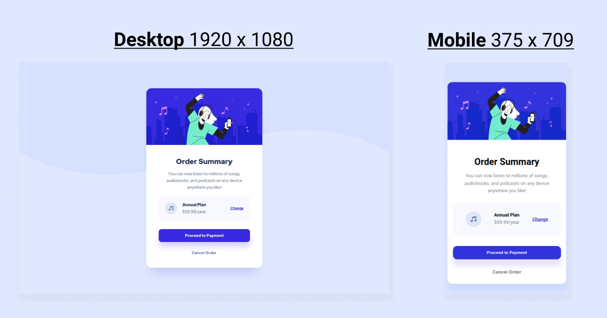

# Frontend Mentor - Order summary card solution

This is a solution to the [Order summary card challenge on Frontend Mentor](https://www.frontendmentor.io/challenges/order-summary-component-QlPmajDUj). Frontend Mentor challenges help you improve your coding skills by building realistic projects.

## Table of contents

- [Overview](#overview)
  - [The challenge](#the-challenge)
  - [Screenshot](#screenshot)
  - [Links](#links)
- [My process](#my-process)
  - [Built with](#built-with)
  - [What I learned](#what-i-learned)
  - [Continued development](#continued-development)
  - [Useful resources](#useful-resources)
- [Author](#author)
- [Acknowledgments](#acknowledgments)

**Note: Delete this note and update the table of contents based on what sections you keep.**

## Overview

### The challenge

Users should be able to:

- See hover states for interactive elements

### Screenshot

### Links

- Solution URL: [Add solution URL here](https://your-solution-url.com)
- Live Site URL: [Add live site URL here](https://your-live-site-url.com)

## My process

I started with getting all the content on the page with HTML, then I grouped the contents in containers (Ended up adding some extra ones later when I started with the layout).

Also had to find a font that resembled the design font, ended up going for roboto, which wasn't a perfect match but close enough for me. Considering I'm not 100% focused on having it pixel perfect since I'm mainly doing the challenge to familiarize myself with HTML & CSS.

When everything was grouped I started applying some basic styles, like background colors, colors, font sizes etc.

And when everything was grouped I focused on laying the contents out properly, by using a lot of flex-box, margins and paddings (honestly think I could have accomplished a lot of the things I was doing a lot more efficiently, and with less code. But I kind of lacked a plan before I went into the whole thing and just tried my way forward.)

I am pretty happy with the result, but think the execution could be better, with a better execution I'm sure the implementation would improve as well since the code would be better organized and easier to work with.

### Built with

- Semantic HTML5 markup
- CSS custom properties
- Flexbox
- Web-first workflow (which I regret)

### What I learned

Was struggling with centering the entire component to the page, but apparently that was because there was no set height applied to one of the containers, once it got a height it worked fine.

Also learned about the background-image properties:
background-repeat: no-repeat;
background-size: 100%;
(Was struggling with the background not reaching the entire width of my window, background-size fixed that issue)

### Continued development

Did not take a mobile first approach on this, and I'm pretty sure doing so would help with the responsiveness of it.

I'd like to have the future pages be a bit more responsive and have the mobile design a bit more exact.

Would also like to master using rems and ems, max-width and min-widths, since I believe these units will help a lot with responsiveness as well.

Css-grid could also be a cool tool to add in my tool-box in the future.

My semantic HTML also needs a bit of work, I'm probably not using the best tags for the different content on the page, which in reality would hurt its SEO and accessibility.

## Author

- Frontend Mentor - [@dinesvlarsen](https://www.frontendmentor.io/profile/dinesvlarsen)
- Twitter - [@dinesvlarsen](https://www.twitter.com/dinesvlarsen)

## Acknowledgments

Want to thank @Manas Khandelwal and @/^([THICC]{5})=>$/ from Jonas Schmedtmanns discord channel for helping me figure out why I couldn't center the component in the middle of the page.

And ofc Frontendmentor for providing the challenge.
